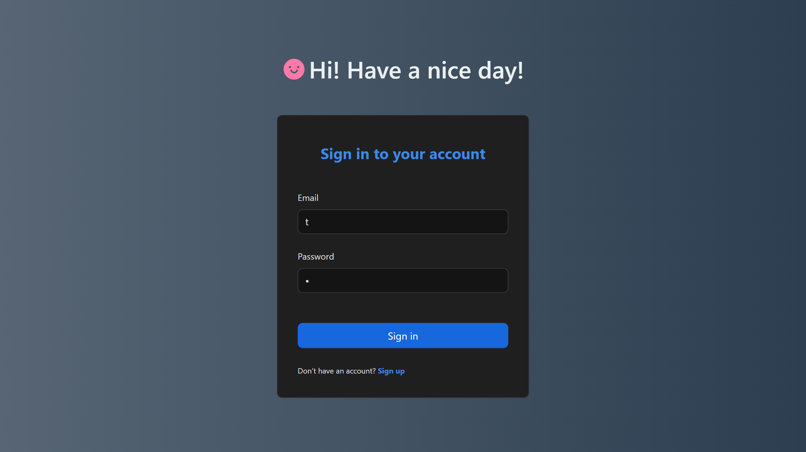
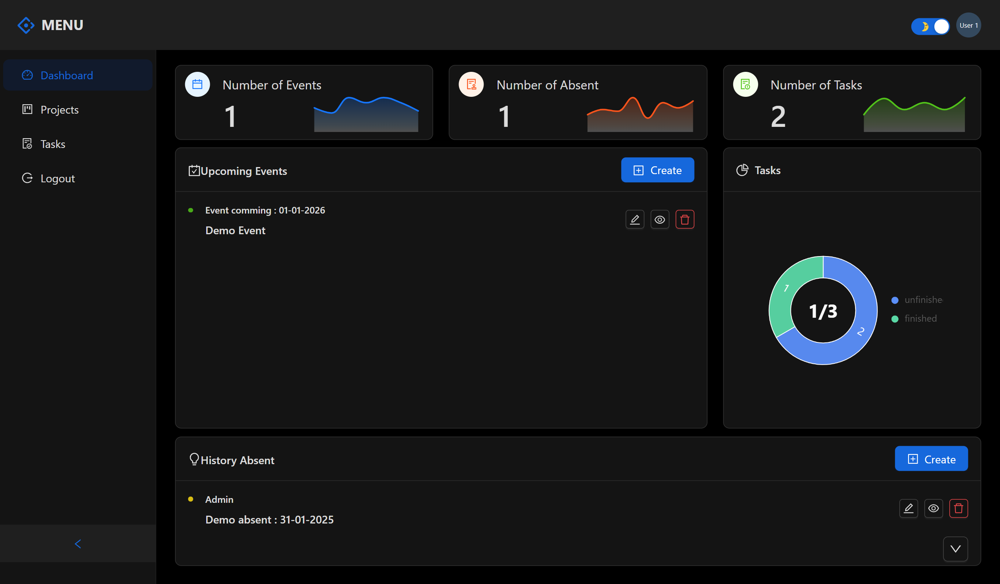
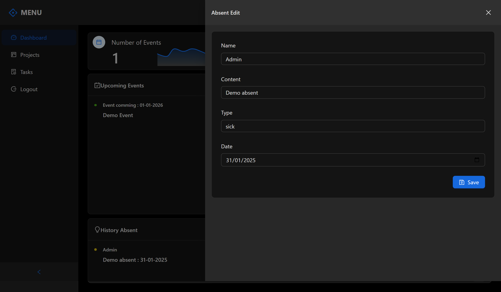
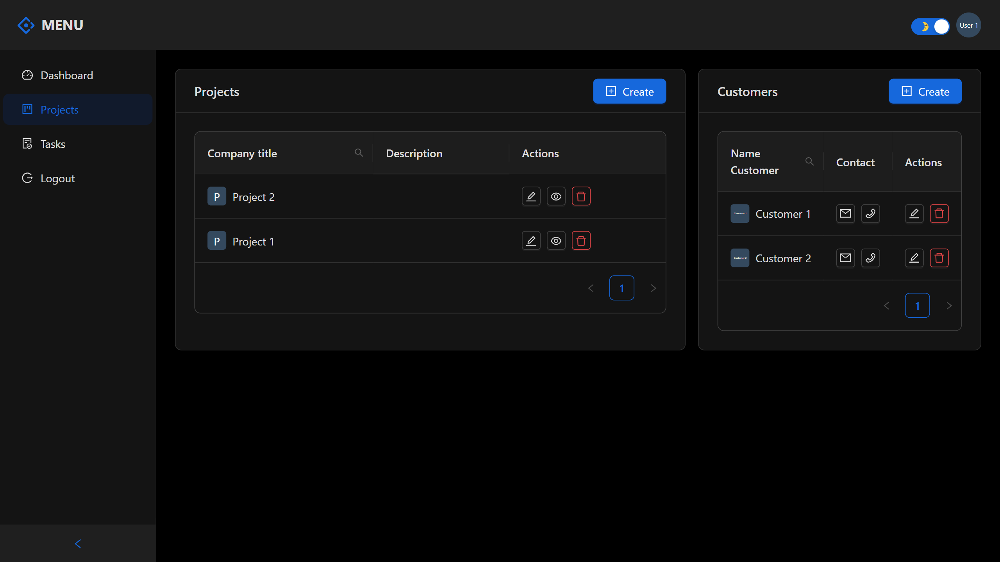
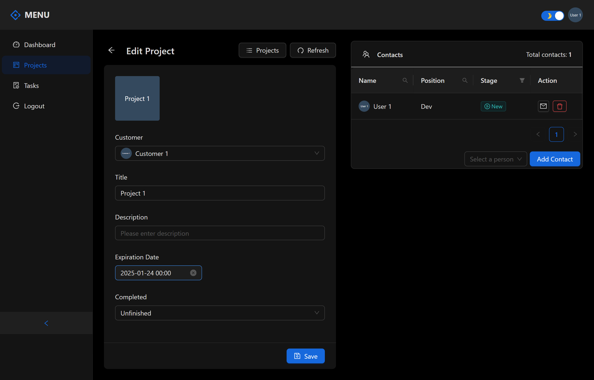
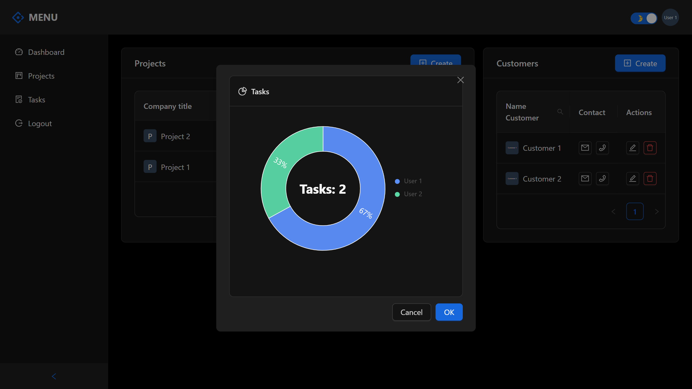
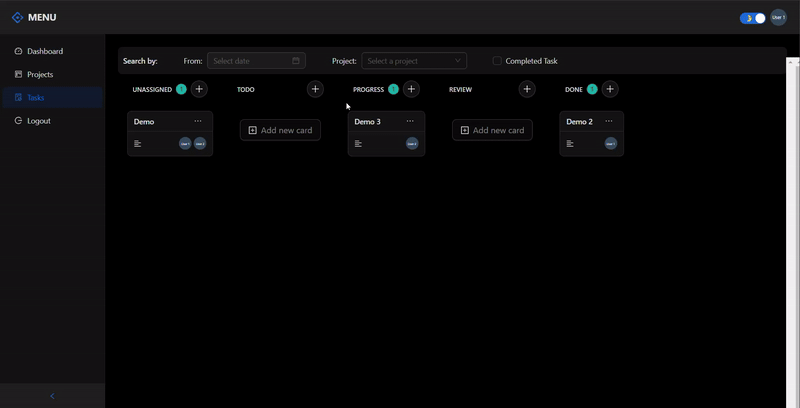
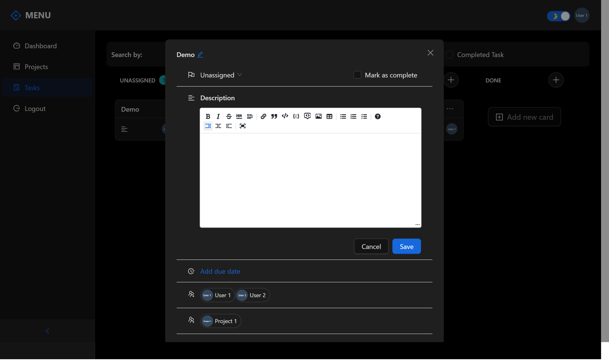
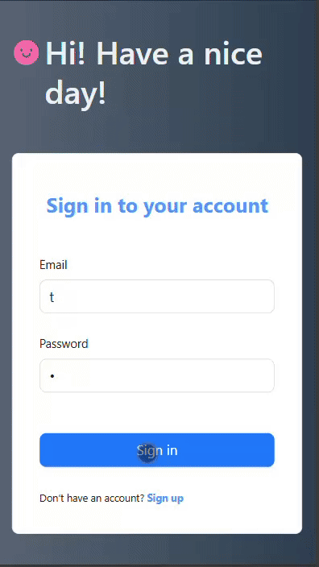

# Task Management

Một trình quản lý nhiệm vụ và dự án đơn giản với nhiều người cùng làm việc.

## 📋 <a name="table">Mục lục</a>

1. 🤖 [Introduction](#introduction)
2. ⚙️ [Tech Stack](#tech-stack)
3. 🔋 [Features](#features)
4. 🚀 [Images](#images)
5. 🔗 [Demo](#demo)

## <a name="introduction">🤖 Introduction</a>

Giao diện ngưởi dùng được xây dựng bằng ReactJS, Refire App framework và Ant Design. Server API được xây dựng bằng Django. Task Management là một dự án đơn giản với mục đích luyện tập xử lý logic liên kết giữa các đối tượng và các tác vụ làm việc với API cơ bản.

## <a name="tech-stack">⚙️ Tech Stack</a>

**Client:** ReactJS, Refire App framework, TypeScript, Ant Design

**Server:** Django

**Deployment:** Docker, Google Cloud VPS

## <a name="features">🔋 Features</a>

👉 **Authentication**: Đăng nhập bằng tài khoản với hình thức xác thực Auth JWT.

👉 **DashBoard**: Tạo và hiển thị các sự kiện sắp tới hoặc xin phép của người dùng. Hiển thị số lượng sự kiện, nhiệm vụ đang được thực hiện và nhiệm vụ hoàn thành.

👉 **Project and Customer**

- **Create Project and Customer**: Người dùng có thể tạo và lưu dự án và khách hàng vào cơ sở dữ liệu.
- **Delete Project and Customer**: Người dùng có thể xóa dự án và khách hàng mà họ sở hữu.
- **Add Contact**: Người dùng có thể thêm liên hệ dự án với các thành viên khác.
- **List, Edit Project and Customer**: Người dùng có thể xem danh sách các dự án và khách hàng và chỉnh sửa thông tin của một dự án hoặc khách hàng.
- **Total Task of Project**: Xem tổng số nhiệm vụ của một dự án và số nhiệm vụ từng thành viên thực hiện trong dự án.

👉 **Tasks Management**: Người dùng có thể tạo nhiệm vụ, gán nhiệm vụ cho dự án, thêm thành viên làm nhiệm vụ, chỉnh sửa tiến độ nhiệm vụ và lọc để tìm kiếm nhiệm vụ theo ngày tháng, dự án hoặc trạng thái nhiệm vụ.

## <a name="images">🚀Images</a>

**Login Page**

  

**DashBoard Page**

  
  

**Project and Customer Page**

  
  
  

**Tasks Management Page**

**Mobi Demo**

## <a name="demo">🔗 Live Demo</a>

- Live Demo [here](https://thanhdev-taskmanage.duckdns.org/)
